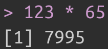

<div class="title-logo"></div>

```{r packages_setup, echo=FALSE, message=FALSE, warning=FALSE}
knitr::opts_chunk$set(echo = T, warning = F, message = F)
knitr::opts_chunk$set(fig.width=8, fig.height=6) 
```

# El lenguaje de programación R

R es un **software libre** de programación especializacido en estadística. RStudio es una interfaz que facilita la programación en R.

- R: lenguaje de comunicación
- RStudio: forma de comunicarse con máquina

```{r, echo=FALSE, out.width = '80%',  fig.align='center'}
knitr::include_graphics("img/r-rstudio.png")
```

```{r, echo=FALSE, out.width = '70%',  fig.align='center'}
knitr::include_graphics("img/RGUI.png")
```


En el siguiente enlace puede encontrarse información acerca de la instalación de R y RStudio en diferentes sistemas operativos.
[https://rstudio-education.github.io/hopr/starting.html](https://rstudio-education.github.io/hopr/starting.html).


## Ejecutar comandos en R

Nos comunicamos con R a través de la consola de comandos. Por ejemplo,
con el siguiente código damos a R la orden de multiplicar 123 por 65.
```{r, echo=TRUE}
123 * 65
```

La respuesta en consola aparece como

```{r, echo=FALSE, out.width = '20%',  fig.align='center'}

```

Suele ser buena práctica explicar el código que se crea. Esto se hace a través de comentarios. Los comentarios se inician con el caracter #. De esta manera, R reconoce que lo que sucede a este caracter es un comentario y no lo ejecuta. Por ejemplo:

```{r, echo=TRUE}
# Esto es un comentario
# Este código ultiplica 100*12
100*12
```

## R como calculadora

Podemos usar R como calculadora. Algunas operaciones básicas son:


```{r, echo=TRUE}
# Suma
2+2
# Resta
2-2
# Multiplicación
2*3
# Divisón
2/3
# Potencias
2^3
# Raíz cuadrada
sqrt(9)
# Logaritmo Natural
log(100)
# Logaritmo en base 10
log(100,10)
# Exponencial
exp(1)
# Valor Absoluto
abs(-4)
# Factorial
factorial(3)
# Combinaciones de 4 en 2
choose(4,2)
```

Ante operaciones de resultado indeterminado, R devuelve un NaN (not a number).


```{r, echo=TRUE}
0/0
```

## Objetos de R

Si queremos un valor (o conjunto de valores) de forma recurrente hay que **guardarlos en memoria**, dándole un nombre.

```{r, echo=TRUE}
# Esto crea un objeto de R con valor pi
a <- pi

# Sumo 3 al valor guardado
a + 3
```

Podemos guardar múltiples valores

```{r, echo=TRUE}
# Esto guarda los números del 1 al 10
b <-1:10
b
```


Los objetos guardados aparecen en la ventana de *Environment* de RStudio

```{r, echo=FALSE, out.width = '100%',  fig.align='center'}
knitr::include_graphics("img/env.png")
```

El nombre de un ojeto no puede empezar con un número, ni tampoco incluír ciertos caracteres especiales como `^`, `$`, `@`, etc.

**Importante**: R sobre-escribe. Observa lo que sucede en este código.

```{r, echo=TRUE}
c <- 5
c

c <- 20
c
```

Se pueden realizar operaciones sobre objetos. R realiza operaciones *element-wise* (elemento a elemento)

* Vector - Número
```{r, echo=TRUE}
b <- 1:10
b + 7
```

* Vector - Vector (misma longitud): R repite el vector corto hasta alcanzar la longitud del largo.
```{r, echo=TRUE}
b * b
```

* Vector - Vector (diferente longitud): R repite el vector corto hasta alcanzar la longitud del largo. Si la longitud del corto no es múltiplo de la del largo lanza un warning

```{r, echo=TRUE}
d <- 1:2
e <- 1:4

d * e
```


R permite combinar objetos con la función `c()`.
Por ejemplo, podemos crear un vector de enteros de la siguiente forma

```{r, echo=TRUE}
a <- c(1,2,3)
a
```

También podemos añadir elementos a un vector existente

```{r, echo=TRUE}
a <- c(a, 4,5)
a
```

No solo podemos crear vectores de números!

```{r, echo=TRUE}
a <- c('adiós', 'hola')
a
```

A continuación, mostramos algunas de las operaciones que podemos realizar sobre vectores

```{r, echo=TRUE}
# Definimos dos vectores a y b
a<-c(1,3,5)
b<-c(2,4,7)
# Multiplicación por escalar
3*a
# Suma
a+b
# Resta
a-b
# Producto (elemento a elemento)
a*b
# División (elemento a elemento)
a/b
# Producto escalar
a %*% b
# Borrar a y b
rm(a,b)
```

Suele ser útil definir secuencias de números consecutivos. Esto en R es muy sencillo

```{r, echo=TRUE}
# Definimos el vector (10,11,...,80)
a<-10:80
a
# Secuencia de 1 a 10 con saltos de 1 (igual que 1:10)
seq(1,10,1)
# Secuencia de 1 a 10 con saltos de 0.1
seq(1,10,0.1)
# Secuencia de 2 a 20 con saltos de 2
seq(2,20,2)
```

Podemos determinar la longitud de un vector usando `length(x)`
```{r, echo=TRUE}
length(a)
```

Y sumar sus elementos usando `sum(x)`
```{r, echo=TRUE}
sum(a)
```

En R, es muy sencillo extraer elementos específicos de un vector.
```{r, echo=TRUE}
# Extraemos el elemento 15
a[15]
# Extraemos los elementos del 18 al 24
a[18:24]
# Extraemos los elementos del 17 al 23 y del 28 al 30
c(a[17:23],a[28:30])
# Extraemos los elementos con valor mayor o igual a 70
a[a>=70]
# Extraemos los elementos con valor mayor o igual a 70 y valor menor a 75
vres<-a[(a>=70)&(a<75)]
vres
```

Prueba lo siguiente:

- Define una secuencia de números del 1 al 100 y súmalos.

- Comprueba que el resultado es idéntico utilzando la expresión demostrada en clase


  $$
  \sum_{i=1}^{K} i = \frac{K \cdot (K + 1)}{2}
  $$

# Estadística Descriptiva en R

La estadística descriptiva es un conjunto de técnicas numéricas y gráficas con las que se intenta descubrir la estructura interna de un conjunto de datos. La estadística descriptiva es una parte fundamental del análisis exploratorio de los datos, que podríamos definir como *el arte de observar los datos, generar hipótesis y testearlas*.

El objetivo de la estadística descriptiva es pues el de generar preguntas prometedoras para, posteriormente, explorarlas en mayor profunidad.

```{r pressure, echo=FALSE, out.width = '80%',  fig.align='center'}
knitr::include_graphics("img/data-science-explore.png")
```


Es fundamental que la estadística descriptiva se realice de manera  **reproducible**. De esta manera, cualquier persona puede replicar el análisis con el fin de cuestionarlo, criticarlo o reafirmarlo. Actualmente existen múltiples herramientas que garantizan la reproducibilidad del análisis de datos.
Una herramienta fundamental es **R (y su interfaz RStudio)**.

En este laboratorio vamos a estudiar las técnicas fundamentales de estadística descriptiva haciendo uso del software R. 

Utilizaremos como referencia el dataset `mtcars`. La base de datos `mtcars` de R contiene información extraída de la *1974 Motor Trend US magazine* acerca de 10 aspectos de diseño de rendimiento de 32 vehículos. Puedes ver las primeras lineas usando

```{r}
head(mtcars)
```

Puedes acceder a más información escribiendo en la consola `?mtcars`.
Para acceder a los valores de cada variable para los 32 vehículos, se utiliza lo siguiente.
```{r}
# Valores de tipo de transmisión
mtcars$am
# Valores de peso de vehículo
mtcars$wt
# Valores de millas por galón
mtcars$mpg
```

## Distribuciones de Frecuencias

Crear una tabla de frecuencias en R requiere utilizar el comando `table()`. Por ejemplo

```{r}
table(mtcars$am)
```

muestra el número de coches (frecuencia simple) con transmisión automática (`am = 0`) y el número de coches con transmisión manual (`am = 1`). 


Para mostrar frecuencias relativas:

```{r}
table(mtcars$am) / length(mtcars$am)
```

También es sencillo elegir nombres más representativos para las columnas

```{r}
tabla_frecuencias <- table(mtcars$am)
names(tabla_frecuencias) <- c("Transmisión Automática", "Transmisión Manual")
tabla_frecuencias
```

Para obtener las frecuencias acumuladas utilizamos la función `cumsum()`

```{r}
cumsum(tabla_frecuencias)
```

Observemos qué sucede para una variable cuantitativa

```{r}
table(mtcars$mpg)
```

Como gran parte de los datos son diferentes, la mayor parte de frecuencias simples son 1. Podemos agrupar valores de la siguiente manera

```{r}
# Comprobamos el rango de la variable
range(mtcars$mpg)

# Creamos las clases de interés
breaks = seq(10, 34, by=4)  

# Creamos la tabla
table( cut(mtcars$mpg, breaks, right = F)  )
```

## Medidas de tendencia central 

R cuenta con muchas funciones que permiten calcular directamente las medidas más características que se utilizan en estadística descriptiva. Repasamos algunas de las más importantes utilizadas sobre la variable `mpg` (millas por galon de diferentes vehículos) 

```{r}
# Media
mean(mtcars$mpg)

# Mediana
median(mtcars$mpg)

# Percentil 25
quantile(mtcars$mpg, 0.25)

# Percentile 99
quantile(mtcars$mpg, 0.99)

# Unos cuantos percentiles
quantile(mtcars$mpg)

# Un resumen de la distribución de la variable
summary(mtcars$mpg)

```

## Medidas de Dispersión

A continuación, mostramos cómo calcular algunas de las medidas de dispersión más importantes

```{r}
# Rango
range(mtcars$mpg)

# Rango intercuartílico
IQR(mtcars$mpg)

# Desviación absoluta media
mad(mtcars$mpg)

# Cuasivarianza
var(mtcars$mpg)

# Raíz de cuasivarianza
sd(mtcars$mpg)

# varianza
var(mtcars$mpg) * (length(mtcars$mpg)-1)/length(mtcars$mpg)

# Obtencion de la varianza
mean((mtcars$mpg-mean(mtcars$mpg))^2)
# otro metodo
sum((mtcars$mpg-mean(mtcars$mpg))^2)/length(mtcars$mpg)

```

## Medidas de forma

Algunas de las medidas de asimetría y curtosis pueden calcularse utilizando el paquete `moments`.

```{r}
library(moments)

# Coeficiente de asimetría
skewness( rnorm(1000) )

# Coeficiente de curtosis (+3)
kurtosis( rnorm(1000) )

```


## Visualización

En esta parte del laboratorio nos centraremos en reproducir en R alguno de los gráficos vistos en la teoría. 


### Visualización de datos cualitativos

Como hemos visto, una de las técnicas de visualización de datos cualitativos más importantes es el  **gráfico de barras**. Podemos representar un gráfico de barras en usando `barplot`:

```{r}
n_vehiculos = table(mtcars$am)
barplot(n_vehiculos, names.arg=c("Automático", "Manual"), 
        xlab="Tipo de Transmisión", ylab="Numero de vehículos", 
        col="gray",
        main = "Numero de vehículos según tipo de transmisión",
        horiz = TRUE)
```

También podemos representar gráficos de escalera
```{r}
nfamilias<-c(5,10,12,6,4,3)

# Dividir la pantalla
par(mfrow=c(1,2)) 

plot(0:5,nfamilias, type="s", col="black",
     xlab="Numero de hijos",
     ylab="Numero de familias")
plot(0:5,cumsum(nfamilias), type="s",col="black",
     xlab="Numero de hijos",
     ylab="Numero de familias")
```

Así pintamos un diagrama de sectores

```{r}
pie(nfamilias, col=rainbow(24), labels=c(0:5), main="Numero de hijos por familia")

pie(nfamilias, col=rainbow(24), labels = nfamilias, edges = 9, 
    main="Numero de hijos por familia")

pie(nfamilias, col=rainbow(24), labels = paste0(nfamilias, "%"), 
    main="Numero de hijos por familia")

# EXTRA: Incluir label y porcentaje
pct <- round(nfamilias/sum(nfamilias)*100)
lab=c(0:5)
lab <- paste(lab, pct) # add % a labels 
lab <- paste(lab, "%", sep="") # ad % to labels
pie(nfamilias, col=rainbow(24), labels = lab, 
    main="Numero de hijos por familia")
```


### Visualización de datos cuantitativos

Para visualizar datos cuantitativos discretos, podemos usar el diagrama de barras de la misma forma que con datos cualitativos. Para datos cuantitativos contínuos, usamos el histograma, la función de densidad y el boxplot.
Podemos representar un histograma utilizando `hist()`. Es sencillo superponer el gráfico de densidad al histograma.

```{r}
hist(mtcars$mpg, col="gray",
     breaks = 15,
     xlab="Millas por galón", 
     prob=TRUE,
     main="Histograma de la variable mpg")
lines(density(mtcars$mpg))
```

Por último, hemos visto que el boxplot puede ser una representación de interés para una variable contínua

```{r}
boxplot(mtcars$mpg, col="gray", main="Diagrama de caja de la variable MPG")

```
